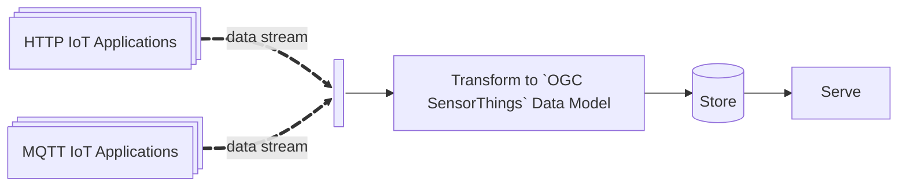
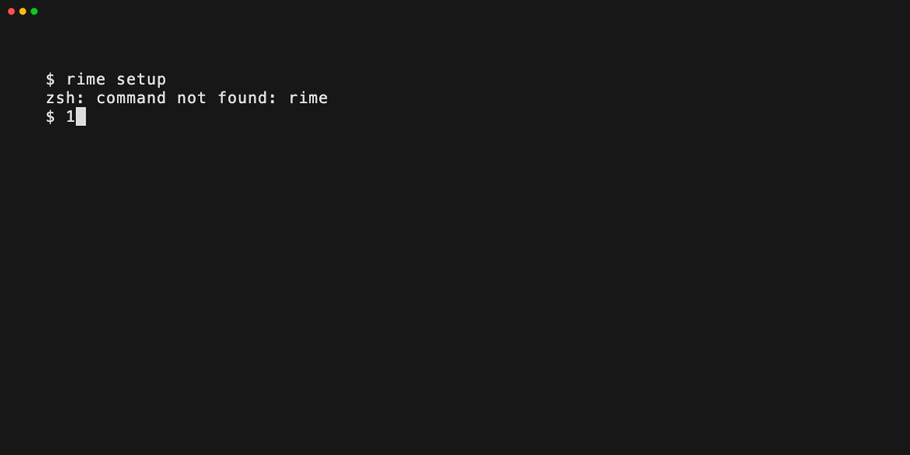
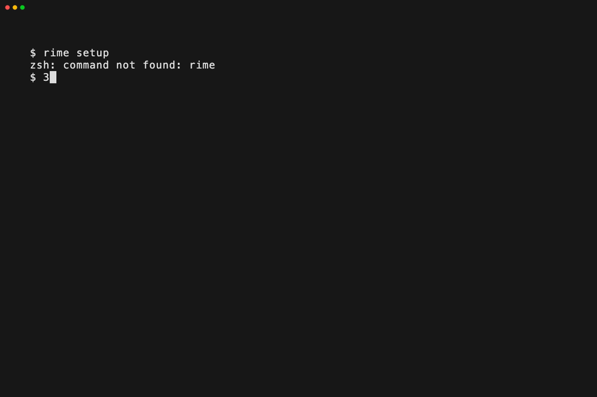

# `rime` 

This project is in active development.

## What is it?

**RIME** is the **R**ealtime **I**ngestion and **M**anagement **E**ngine for
Fraunhofer's [FROST Server](https://github.com/FraunhoferIOSB/FROST-Server). It
makes deploying [OGC SensorThings API
(STA)](https://www.ogc.org/publications/standard/sensorthings/) compliant sensor
IoT applications easy! OGC is the Open Geospatial Consortium and develops
geospatial standards that make sharing geospatial information interoperable.

Observations from sensors are used for many things, and having an interoperable
data model and API like STA makes producing data products a walk in the park.

This application is built in the spirit of that interoperability. The following
are its core features:

- Add, delete and manage IoT applications through an intuitive CLI,
- Keep your sensors STA compliant - the app takes care of transformation and
  management under the hood,
- Spin up a batteries-included web-based Sensor Dashboard,

The application currently supports a limited number of IoT applications and
sensors: this list is expected to grow. 



## System Requirements

The system requirements are fairly minimal:

- `docker` and `docker compose`
- `git`
- `python >=3.9`

## Deployment Requirements

Deployment requires and assumes you have access (credentials) to sensor IoT
applications. More technically:

### Upstream Data Sources

You must have authenticated access to one or more Upstream Data Sources.
RIME supports ingestion from:

- RESTful APIs: Sources providing observations via HTTP GET/POST (e.g.,
  proprietary vendor clouds)

- MQTT Brokers: Sources publishing to topics (e.g., The Things Network). 

### Sensor Specifications and Architecture

The application will do the heavy lifting in helping you set up your existing
sensors to match the STA data model. It does however assume you have enough
information about *what* the sensor is observing to be able to specify the
*Thing* and *Location* components of the STA datamodel:


## Setup

The overall setup involves:

1. Cloning the repository,
2. Setting up mandatory internal credentials, 
3. Setting up external IoT applications and credentials,
4. Writing sensor configuration files.
5. Launching the system!

### Step 1: Clone the Repo and Create a Python Virtual Environment

```bash
git clone https://github.com/justinschembri/st-utils.git rime
cd rime
python3 -m venv .venv
source .venv/bin/activate
pip install -e .
```

> [!TIP]
> The application uses many configuration files. If you wish to keep these files
> separate from the RIME code (for separate version control) this is
> possible. Add a `.env` file to `/deploy/` and provide the `SENSOR_CONFIG_PATH`
> and the `APPLICATION_CONFIG_FILE` path variables; e.g.,:
> 
> SENSOR_CONFIG_PATH="/Users/johndoe/opt/st-utils-ops/sensor_configs/"
> APPLICATION_CONFIG_FILE="/Users/johndoe/opt/st-utils-ops/application-configs.yml"


### Step 2: Mandatory Internal Credentials

To quickly set up your instance of RIME, use the inbuilt tooling:

```bash
$ rime setup
```

Upon the first launch of the CLI, you will be guided through setting up
mandatory internal credentials. 


The system uses default usernames (`sta-admin`) which you can accept or
override:

- **FROST**: Credentials for the FROST server (needed for data access and writing)
- **PostgreSQL**: Credentials for the backend PostgreSQL database
- **MQTT**: Internal Mosquitto users (at least one user is required)
- **Tomcat**: Web application authentication (optional)

All credentials are stored in the `deploy/secrets/credentials` directory.

### Step 3: Configure Applications

After setting up internal credentials, it's time to set up the IoT applications
you have access to. Having 'access' to an IoT application means you have the
required credentials or tokens to pull data from the IoT application. See
[Supported Applications](#supported-applications) for the full list. 

Run `rime setup` if it's closed and select [1] to set up the IoT applications you
have access to.  The app will guide you through the set up of (supported) HTTP
and MQTT applications:



Applications are controlled by the YAML file
`deploy/application-configs.yml`. You should not need to manually touch this
file.

### Step 4: Configure Sensor Configurations

Each physical sensor in your network requires a configuration file that
describes the sensor, its location, the thing it monitors, and the datastreams
it produces. Again, using `rime setup` is the easiest, select item [2] and you'll
again be guided through setting up of (supported) sensors:


Sensor configs are finicky YAML files that live in the `deploy/sensor_configs/`
directory. 

You can check the status of your applications using item [3] in the menu:



### Step 5: Start the App:

Spin up the system using `rime start`, and stop it with `rime stop`.


By default, the application starts in a "public" mode that does not implement any
*read* authentication. *Write* authentication is controlled by the FROST
credentials you should have set up earlier. If you want to start in a "private"
mode and have set up Tomcat users, then pass the --private flag: `rime start
--private`.

The application should be connecting, receiving, parsing, transforming and
storing your data. You can head over to `http://localhost:8080/rime` to
check this out and explore your data visually and download it as a CSV. The
back-end FROST server is available at `http://localhost:8080/FROST-Server`. 


You can also check out the health monitor to see how your system is performing.


## Supported Applications

RIME supports integration with the following IoT application platforms:

- **Netatmo** (`NetatmoProvider`): HTTP poll provider for Netatmo weather
  station APIs
- **TheThingsStack** (`TTSProvider`): MQTT subscription provider for The
  Things Network

## Supported Sensor Models

The following sensor models are currently supported:

### Milesight
- **Milesight AM103L** (`milesight.am103l`): Indoor Air Quality Sensor (3-in-1)
- **Milesight AM308L** (`milesight.am308l`): Indoor Air Quality Sensor (7-in-1)

### Netatmo
- **Netatmo NWS03** (`netatmo.nws03`): Home Weather Station

