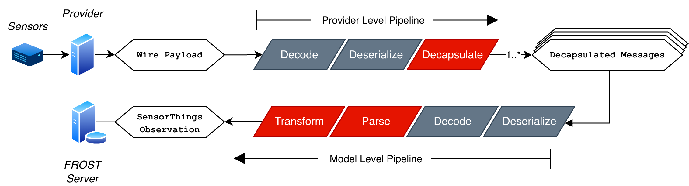

# `rime` 

rime is in active development.

## What is it?

**rime** is the **R**ealtime **I**ngestion and **M**anagement **E**ngine for
Fraunhofer's [FROST Server](https://github.com/FraunhoferIOSB/FROST-Server)
which is a compliant implementation of the [OGC SensorThings
API](https://www.ogc.org/publications/standard/sensorthings/) `rime` provides
out-of-the-box support for various IoT transport protocols, IoT providers, and
sensor-models through decoders, deserializers and decapsulators.

Its two tiered pipeline first implements a decoding, deserialization and
decapsulation pipeline for a given IoT *provider* such as
[TheThingsNetwork](https://www.thethingsnetwork.org/). It second tier handles
a similar pipeline on a model-by-model basis that ultimately parses, transforms
and pushes to a local or remote FROST instance:



Core features:

- Configure and manage upstream IoT applications through the CLI
- Keep sensor data STA-compliant through a shared ingest pipeline
- Run a built-in web dashboard for browsing and exporting data

Contributor guide: see [`CONTRIBUTING.md`](CONTRIBUTING.md) for the transport/provider/decapsulator/sensor-model checklist.


## System Requirements

The system requirements are fairly minimal:

- `docker` and `docker compose`
- `git`
- `python >=3.9`

## Deployment Requirements

Deployment assumes you have credentials for one or more upstream IoT
applications.

### Upstream Data Sources

You must have authenticated access to one or more upstream data sources.
rime supports ingestion from:

- RESTful APIs: Sources providing observations via HTTP GET/POST (e.g.,
  proprietary vendor clouds)

- MQTT brokers: Sources publishing to topics (e.g., The Things Network)

### Sensor Specifications and Architecture

The application helps map your sensors to the STA model, but you still need to
know what each sensor observes so you can define the required entities in your
sensor configs:

- `Thing` (what is being observed)
- `Location` (where it is)
- `Sensor` (which device)
- `Datastream` (which variable/time-series)

## Setup

The overall setup:

1. Cloning the repository
2. Setting up mandatory internal credentials
3. Setting up external IoT applications and credentials
4. Writing sensor configuration files.
5. Launching the system

### Step 1: Clone the repo and create a Python virtual environment

```bash
git clone https://github.com/justinschembri/rime.git rime
cd rime
python3 -m venv .venv
source .venv/bin/activate
pip install -e .
```

> [!TIP]
> The application uses several configuration files. If you want to keep these
> files separate from the rime codebase, add a `.env` file to `/deploy/` and provide
> the `SENSOR_CONFIG_PATH`
> and the `APPLICATION_CONFIG_FILE` path variables; e.g.,:
> 
> SENSOR_CONFIG_PATH="/Users/johndoe/opt/st-utils-ops/sensor_configs/"
> APPLICATION_CONFIG_FILE="/Users/johndoe/opt/st-utils-ops/application-configs.yml"


### Step 2: Set up mandatory internal credentials

To quickly bootstrap a local rime instance, use:

```bash
rime setup
```

Upon the first launch of the CLI, you will be guided through setting up
mandatory internal credentials.

The system uses default usernames (`sta-admin`) which you can accept or
override:

- **FROST**: Credentials for the FROST server (needed for data access and writing)
- **PostgreSQL**: Credentials for the backend PostgreSQL database
- **MQTT**: Internal Mosquitto users (at least one user is required)
- **Tomcat**: Web application authentication (optional)

All credentials are stored in the `deploy/secrets/credentials` directory.

### Step 3: Configure applications

After internal credentials are configured, set up the IoT applications you can
access. "Access" means you have the credentials or tokens needed to read
payloads from that application. See [Supported Applications](#supported-applications)
for the current list.

Run `rime setup` and select item `[1]` to configure supported HTTP and MQTT
applications.

Applications are controlled by the YAML file
`deploy/application-configs.yml`. You should not need to manually touch this
file.

### Step 4: Configure sensor definitions

Each physical sensor in your network requires a configuration file that
describes the sensor, its location, the thing it monitors, and the datastreams
it produces. Using `rime setup` is the easiest path: select item `[2]` to create
supported sensor configurations.

Sensor configs are YAML files in `deploy/sensor_configs/`.

You can check application status using item `[3]` in the same menu.

### Step 5: Start the app

Start the stack with `rime start`, and stop it with `rime stop`.

By default, rime starts in "public" mode with no read authentication. Write
authentication is controlled by the FROST credentials configured earlier. To
run in "private" mode (after setting up Tomcat users), pass `--private`:
`rime start --private`.

The application should now connect, ingest, transform, and store data. Open
`http://localhost:8080/rime` to explore and export data as CSV. The backend FROST server is
available at `http://localhost:8080/FROST-Server`.

## CLI Tapes

The terminal demos live in `docs/tapes/` as VHS `.tape` files.

| Tape file | Output artifact | Covers |
| --- | --- | --- |
| `credentials-input.tape` | `docs/tapes/credentials.gif` | `rime setup` internal credential bootstrap |
| `application-setup.tape` | `docs/tapes/application.gif` | adding/updating application connections |
| `config-setup.tape` | `docs/tapes/config.gif` | creating sensor config entries |
| `manage.tape` | `docs/tapes/manage.gif` | listing/managing configured applications |
| `start.tape` | `docs/tapes/start.gif` | starting the stack with `rime start` |

Rebuild tapes (requires [VHS](https://github.com/charmbracelet/vhs)):

```bash
vhs docs/tapes/credentials-input.tape
vhs docs/tapes/application-setup.tape
vhs docs/tapes/config-setup.tape
vhs docs/tapes/manage.tape
vhs docs/tapes/start.tape
```

## Supported Applications

rime supports integration with the following IoT application platforms:

- **Netatmo** (`NetatmoProvider`): HTTP poll provider for Netatmo weather
  station APIs
- **TheThingsStack** (`TTSProvider`): MQTT subscription provider for The
  Things Network

## Supported Sensor Models

The following sensor models are currently supported:

### Milesight
- **Milesight AM103L** (`milesight.am103l`): Indoor Air Quality Sensor (3-in-1)
- **Milesight AM308L** (`milesight.am308l`): Indoor Air Quality Sensor (7-in-1)

### Netatmo
- **Netatmo NWS03** (`netatmo.nws03`): Home Weather Station

