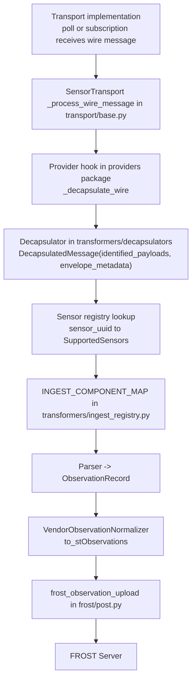

# `src/rime` architecture

Core runtime package for rime. This is where upstream wire messages are ingested,
decapsulated, parsed into SensorThings observations, and uploaded to FROST.

For contribution decision paths (new transport vs provider vs decapsulator vs sensor model),
see [`../../CONTRIBUTING.md`](../../CONTRIBUTING.md).

## End-to-end pipeline

## Pipeline responsibilities

| Stage | Module | Responsibility |
| --- | --- | --- |
| Transport lifecycle | [`transport/`](transport/README.md) | Owns thread lifecycle, retries, and calls `_process_wire_message` for each wire message. |
| Provider integration | [`providers/`](providers/README.md) | Owns source-specific auth/fetch and `_decapsulate_wire`. |
| Decapsulation | [`transformers/decapsulators/`](transformers/decapsulators/README.md) | Strips provider shell; emits `DecapsulatedMessage` with `list[IdentifiedPayload]` and optional `EnvelopeMetadata`. |
| Model ingest wiring | [`transformers/ingest_registry.py`](transformers/ingest_registry.py) | Maps `SupportedSensors` → parser and normalizer classes. |
| Parse | [`transformers/parsers/`](transformers/parsers/README.md), [`transformers/messages.py`](transformers/messages.py) | Validates payload, resolves timestamps, extracts observation fields; produces `ObservationRecord`. |
| STA normalization | [`transformers/normalizers/`](transformers/normalizers/README.md) | Maps `ObservationRecord.observations` fields → `ObservedProperties` → `Observation` tuples. |
| FROST writes | [`frost/`](frost/README.md), [`frost/post.py`](frost/post.py) | Resolves datastream URL and posts each observation. |

## Execution path in code

1. Transport receives one `wire_message` and calls `SensorTransport._process_wire_message`.
2. Provider decapsulates the wire message into a `DecapsulatedMessage` (one `IdentifiedPayload` per sensor).
3. For each `IdentifiedPayload`, rime resolves the sensor model from `sensor_registry`.
4. `INGEST_COMPONENT_MAP` selects the parser and normalizer for that model.
5. rime runs `parser.parse → ObservationRecord → normalizer.from_record → to_stObservations`.
6. Each observation tuple is uploaded through `frost_observation_upload`.

## Subpackage map

- `transport/`: abstract transport contracts and threading orchestration
- `providers/`: concrete source integrations (e.g., TTS, Netatmo)
- `transformers/`: decapsulation, parsing, and STA normalization stages
- `frost/`: SensorThings entity lookup and write helpers
- `monitor.py`: runtime health counters and restart supervision support
- `types.py`, `exceptions.py`, `paths.py`: shared contracts and utilities
