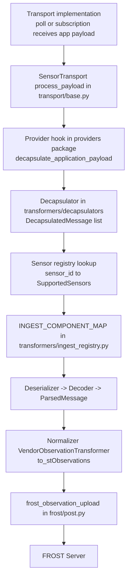

# `src/rime` architecture

Core runtime package for rime. This is where upstream payloads are ingested,
decapsulated, transformed into SensorThings observations, and uploaded to FROST.

## End-to-end pipeline

## Pipeline responsibilities

| Stage | Module | Responsibility |
| --- | --- | --- |
| Transport lifecycle | [`transport/`](transport/README.md) | Owns thread lifecycle, retries, and calls `_process_payload` for each payload. |
| Provider integration | [`providers/`](providers/README.md) | Owns source-specific auth/fetch and app-level decapsulation hook. |
| Decapsulation | [`transformers/decapsulators/`](transformers/decapsulators/README.md) | Converts provider payloads into routed `DecapsulatedMessage` objects. |
| Model ingest wiring | [`transformers/ingest_registry.py`](transformers/ingest_registry.py) | Maps `SupportedSensors` -> deserializer, decoder, transformer classes. |
| Decode + parse | [`transformers/deserializers/`](transformers/deserializers/README.md), [`transformers/decoders/`](transformers/decoders/README.md), [`transformers/messages.py`](transformers/messages.py) | Converts payload shape/semantics into `ParsedMessage` for normalization. |
| STA normalization | [`transformers/normalizers/`](transformers/normalizers/README.md) | Creates SensorThings `Observation` tuples with datastream names. |
| FROST writes | [`frost/`](frost/README.md), [`frost/post.py`](frost/post.py) | Resolves datastream URL and posts each observation. |

## Execution path in code

1. Transport receives one `app_payload` and calls `SensorTransport._process_payload`.
2. Provider decapsulates the payload into one or more `DecapsulatedMessage` entries.
3. For each message, rime resolves the sensor model from `sensor_registry`.
4. `INGEST_COMPONENT_MAP` selects deserializer, decoder, and transformer for that model.
5. rime runs `deserialize -> decode -> ParsedMessage -> from_parsed -> to_stObservations`.
6. Each observation tuple is uploaded through `frost_observation_upload`.

## Subpackage map

- `transport/`: abstract transport contracts and threading orchestration
- `providers/`: concrete source integrations (e.g., TTS, Netatmo)
- `transformers/`: decapsulation, decoding, and STA normalization stages
- `frost/`: SensorThings entity lookup and write helpers
- `monitor.py`: runtime health counters and restart supervision support
- `types.py`, `exceptions.py`, `paths.py`: shared contracts and utilities

